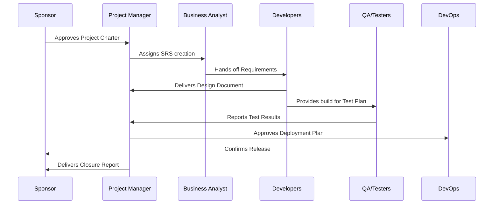

project-documentation

Here’s what your **document process** might look like in a sequence diagram:

```mermaid
sequenceDiagram
    participant Sponsor
    participant PM as Project Manager
    participant BA as Business Analyst
    participant Dev as Developers
    participant QA as QA/Testers
    participant Ops as DevOps

    Sponsor->>PM: Approves Project Charter
    PM->>BA: Assigns SRS creation
    BA->>Dev: Hands off Requirements
    Dev->>PM: Delivers Design Document
    Dev->>QA: Provides build for Test Plan
    QA->>PM: Reports Test Results
    PM->>Ops: Approves Deployment Plan
    Ops->>Sponsor: Confirms Release
    PM->>Sponsor: Delivers Closure Report
```