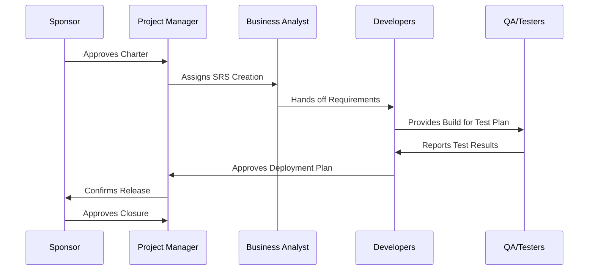

# 📁 Project Documentation Starter Kit
*A practical knowledge-management framework for real software teams*

## Purpose

This repository provides a **lightweight but complete documentation stack** for software projects — from kickoff to delivery and closure.

While modern Agile methods emphasize working software over heavy documentation, teams **still benefit from a shared, structured knowledge base**.
This repo exists to help engineers and organizations strike that balance.

## Why This Matters

Too many engineering teams depend on:

* Tribal knowledge
* Slack history
* The most senior engineer’s memory
* Code comments that don’t explain *why* decisions were made

That approach works — **until it doesn’t**:

* Team members leave
* Complex systems change hands
* A feature needs to be revived six months later
* An audit, migration, or compliance request pops up

Foundational documentation:
✔ Builds organizational memory
✔ Helps new developers onboard faster
✔ Reduces ambiguity and rework
✔ Improves stakeholder alignment
✔ Produces better engineers over time

Agile doesn’t reject documentation — it rejects **useless** documentation.
This repo focuses on the **minimum effective set**.

## Included Templates

The repository includes editable templates for every stage of a project:

| File                                      | Purpose                                          |
| ----------------------------------------- |--------------------------------------------------|
| **0.DocGuide.md**                         | How to use each document + best practices        |
| **1.Project_char.md**                     | Why the project exists, scope, business case     |
| **2.SoftwareRequirementSpecification.md** | Functional + non-functional requirements         |
| **3.SoftwareDesignDocumentation.md**      | Architecture, interfaces, data flow              |
| **4.TestPlan.md**                         | Test strategy, acceptance criteria, roles        |
| **5.DeploymentOrReleasePlan.md**          | Deployment steps, rollback, environments         |
| **6.ProjectClosureReport.md**             | Lessons learned, what went well, what to improve |
| **template.md**                           | Example of docuemnt use.                         | 

All documents are written to be:

* Editable
* Modular
* Scaleable between small and large teams

## Suggested Flow

Here’s a simplified lifecycle model for using the templates:

Projects may not always follow this exact pattern — but the documents remain relevant across methodologies, including Agile, Scrum, hybrid, and regulated environments.

## Who Is This For?

* **Junior engineers** — exposure to real-world artifacts they’ll see later
* **Students** — bridge between school and professional practice
* **New teams** — setting structure where none exists
* **Agile teams** — lightweight artifacts that support velocity, not block it
* **Organizations with compliance needs** — repeatable, defensible documentation

## My Perspective

Documentation doesn’t slow engineers down — **lack of clarity does**.

This repo reflects a belief that:

> Engineers become stronger when they understand *not just how* code works, but *why decisions are made* around it.

By keeping a small library of core documents:

* You preserve knowledge
* You enhance communication
* You build maturity into teams
* You improve software outcomes

This repo is one step toward that goal.

---

## Contributions Welcome

If you have templates, improvements, or alternate flows — feel free to open a PR or raise a discussion.