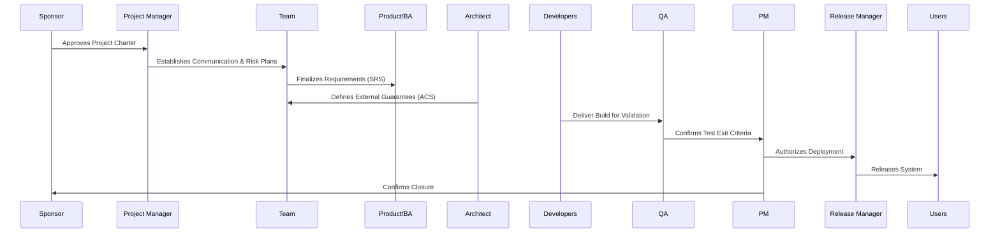

# Project Documentation Starter Kit

*A practical, governance-aware knowledge framework for real software teams*

---

## Purpose

This repository provides a **lightweight but complete project documentation system** for software teams — from initiation through delivery and formal closure.

While modern Agile practices emphasize working software, **successful teams still need shared, durable knowledge**:

* Why decisions were made
* What guarantees were promised
* How change was controlled
* Where risk lived and how it was mitigated

This repository exists to provide the **minimum effective documentation set** that supports delivery *without becoming bureaucracy*.

---

## Why This Matters

Too many engineering teams rely on:

* Tribal knowledge
* Slack or chat history
* The memory of the most senior engineer
* Code comments that explain *what*, but not *why*

That works — **until it doesn’t**:

* Team members leave
* Ownership changes
* Systems grow more complex
* A feature must be revived months later
* Audits, migrations, or compliance reviews appear

Foundational documentation:

* Preserves organizational memory
* Accelerates onboarding
* Reduces ambiguity and rework
* Improves stakeholder alignment
* Produces stronger engineers over time

Agile does not reject documentation — it rejects **documentation without value**.
This repository focuses on **documentation that earns its keep**.

---

## What This Repository Includes

A **complete, end-to-end documentation lifecycle**, designed to scale from small teams to regulated environments.

| File                                       | Purpose                                                   |
| ------------------------------------------ | --------------------------------------------------------- |
| **0.DocGuide.md**                          | How to read, write, and use each document                 |
| **1.ProjectCharter.md**                    | Project authorization, scope, objectives, high-level risk |
| **2.StakeholderCommunicationPlan.md**      | Who needs to know what, when, and how                     |
| **3.RiskManagementPlan.md**                | Centralized risk register and mitigation tracking         |
| **4.SoftwareRequirementsSpecification.md** | Functional and non-functional requirements                |
| **5.ArchitectureContractSpecification.md** | External system guarantees (APIs, schemas, SLOs)          |
| **6.SoftwareDesignDocument.md**            | Internal architecture and design decisions                |
| **7.ChangeManagementPlan.md**              | Controlled change and impact governance                   |
| **8.TestPlan.md**                          | Verification and validation strategy                      |
| **9.DeploymentReleasePlan.md**             | Deployment, rollback, and release control                 |
| **10.ProjectClosureReport.md**             | Outcomes, lessons learned, and formal closure             |
| **template.md**                            | Example showing how templates are used together           |

All templates are designed to be:

* Editable
* Modular
* Traceable
* Scalable across team sizes and delivery models

---

## How the Documents Work Together

This is **not a pile of documents** — it is a **system**.

Each document answers a specific question:

* Why are we doing this?
* What are we building?
* What do we promise externally?
* How is it built internally?
* What could go wrong?
* How do we control change?
* How do we verify and release?
* What did we learn?

---

## Suggested Lifecycle Flow

Projects may vary in execution style (Agile, Scrum, Hybrid, Regulated),
but **the documentation roles remain consistent**.

---

## Who This Is For

* **Junior engineers** — exposure to real-world artifacts early
* **Students** — bridge between academic work and professional practice
* **New teams** — establish structure without heavy process
* **Agile teams** — lightweight governance that supports velocity
* **Organizations with compliance needs** — auditable, defensible documentation

---

## Design Philosophy

Documentation does not slow teams down — **uncertainty does**.

This repository reflects a simple belief:

> Engineers become stronger when they understand not just *how* systems work, but *why* decisions were made.

By maintaining a small, intentional set of documents:

* Knowledge is preserved
* Communication improves
* Change becomes safer
* Architecture becomes explicit
* Teams mature naturally

This is **not about paperwork** — it is about **clarity and continuity**.
