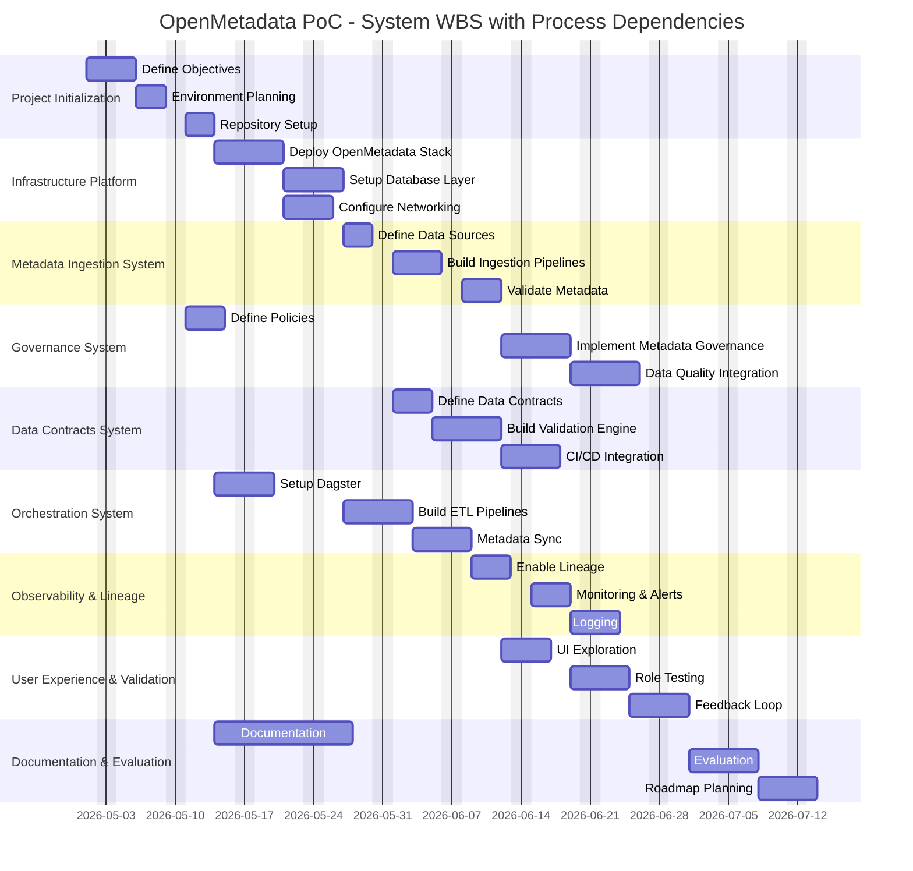

```mermaid
gantt
    title OpenMetadata PoC - System WBS with Process Dependencies
    dateFormat  YYYY-MM-DD
    excludes    weekends

    section Project Initialization
    Define Objectives              :init_obj, 2026-05-01, 3d
    Environment Planning           :env_plan, after init_obj, 3d
    Repository Setup               :repo_setup, after env_plan, 3d

    section Infrastructure Platform
    Deploy OpenMetadata Stack      :infra_stack, after repo_setup, 5d
    Setup Database Layer           :infra_db, after infra_stack, 4d
    Configure Networking           :infra_net, after infra_stack, 3d

    section Metadata Ingestion System
    Define Data Sources            :ingest_sources, after infra_db, 3d
    Build Ingestion Pipelines      :ingest_pipes, after ingest_sources, 5d
    Validate Metadata              :ingest_validate, after ingest_pipes, 4d

    section Governance System
    Define Policies                :gov_policies, after env_plan, 4d
    Implement Metadata Governance  :gov_metadata, after ingest_validate, 5d
    Data Quality Integration       :gov_quality, after gov_metadata, 5d

    section Data Contracts System
    Define Data Contracts          :contracts_define, after ingest_sources, 4d
    Build Validation Engine        :contracts_engine, after contracts_define, 5d
    CI/CD Integration              :contracts_cicd, after contracts_engine, 4d

    section Orchestration System
    Setup Dagster                  :dagster_setup, after repo_setup, 4d
    Build ETL Pipelines            :dagster_etl, after infra_db, 5d
    Metadata Sync                  :dagster_sync, after dagster_etl, 4d

    section Observability & Lineage
    Enable Lineage                 :lineage_enable, after dagster_sync, 4d
    Monitoring & Alerts            :monitoring, after lineage_enable, 4d
    Logging                        :logging, after monitoring, 3d

    section User Experience & Validation
    UI Exploration                 :ui_explore, after ingest_validate, 3d
    Role Testing                   :role_testing, after gov_metadata, 4d
    Feedback Loop                  :feedback, after role_testing, 4d

    section Documentation & Evaluation
    Documentation                  :docs, after repo_setup, 10d
    Evaluation                     :evaluation, after feedback, 5d
    Roadmap Planning               :roadmap, after evaluation, 4d
```